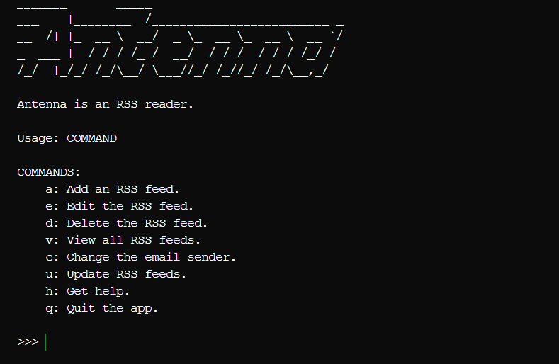

# Antenna - CLI RSS Reader



## 使い方

```bash
$ ./antenna
```

### コマンド

- a: フィードを追加
- e: フィードを編集
- d: フィードを削除
- v: 全てのフィードを表示
- c: メール送信元を変更
- u: 全てのフィードの更新を確認
- h: ヘルプを表示
- q: アプリを終了

## 使用上の注意点

- メールの送信元にGmailを使用する場合、アプリパスワードの作成が必要になる可能性があります。

## ビルド方法

```bash
$ go build -o antenna cmd/antenna/main.go
```
